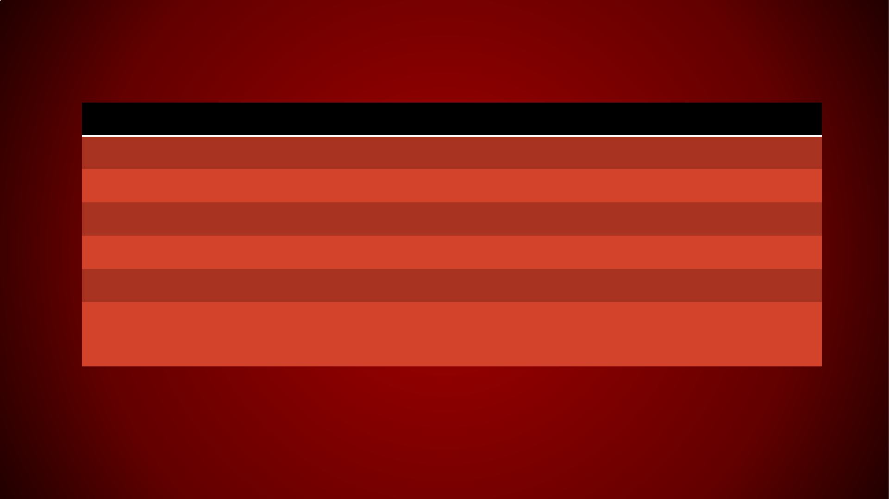

+++
title = "Galego"
tags = ["galician"]
date = "2020-02-23"
disableToc = "true"
summary = "Galego"
+++

<!DOCTYPE html>
<!-- Created by pdf2htmlEX (https://github.com/coolwanglu/pdf2htmlex) -->
<html xmlns="http://www.w3.org/1999/xhtml">
<head>
<meta charset="utf-8"/>

<meta http-equiv="X-UA-Compatible" content="IE=edge,chrome=1"/>
<link rel="stylesheet" href="base.min.css"/>
<link rel="stylesheet" href="fancy.min.css"/>
<link rel="stylesheet" href="main.css"/>

<title></title>
</head>
<body>

GALEGO – ESPAÑOL - PORTUGUÉS

GRAMÁTICA CONTRASTIVA DAS CONXUGACIÓNS VERBAIS

CONXUGACIÓNS VERBAIS NO GALEGO

• Presente de Indicativo

• Pretérito

• Copretérito

• Futuro

• Imperativo afirmativo

• Imperativo negativo

PRESENTE DE INDICATIVO EN -AR

PERSOA GALEGO ESPAÑOL PORTUGUÉS

1. amo amo amo

2. amas amas amas

3. ama ama ama

1. amamos amamos amamos

2. amades amáis (amais)

3. aman aman amam

PRESENTE DE INDICATIVO EN -ER

PERSOA GALEGO ESPAÑOL PORTUGUÉS

1. bebo bebo bebo

2. bebes bebes bebes

3. bebe bebe bebe

1. bebemos bebemos bebemos

2. bebedes bebéis (bebeis)

3. beben beben bebem

PRESENTE DE INDICATIVO EN -IR

PERSOA GALEGO ESPAÑOL PORTUGUÉS

1. parto parto parto

2. partes partes partes

3. parte parte parte

1. partimos partimos partimos

2. partides partís (partis)

3. parten parten partem

PRETÉRITO DE INDICATIVO EN -AR

PERSOA GALEGO ESPAÑOL PORTUGUÉS

1. amei amé amei

2. amaches amaste amaste

3. amou amó amou

1. amamos amamos amámos

2. amastes amasteis (amastes)

3. amaron amaron amaram

PRETÉRITO DE INDICATIVO EN -ER

PERSOA GALEGO ESPAÑOL PORTUGUÉS

1. bebín bebí bebi

2. bebiches bebiste bebeste

3. bebeu bebió bebeu

1. bebemos bebimos bebemos

2. bebestes bebisteis (bebestes)

3. beberon bebieron beberam

PRETÉRITO DE INDICATIVO EN -IR

PERSOA GALEGO ESPAÑOL PORTUGUÉS

1. partín partí parti

2. partiches partiste partiste

3. partiu partió partiu

1. partimos partimos partimos

2. partistes partisteis (partistes)

3. partiron partieron partiram

COPRETÉRITO DE INDICATIVO EN -AR

PERSOA GALEGO ESPAÑOL PORTUGUÉS

1. amaba amaba amava

2. amabas amabas amavas

3. amaba amaba amava

1. amabamos amábamos amávamos

2. amabades amabais (amáveis)

3. amaban amaban amavam

COPRETÉRITO DE INDICATIVO EN -ER

PERSOA GALEGO ESPAÑOL PORTUGUÉS

1. bebía bebía bebia

2. bebías bebías bebias

3. bebía bebía bebia

1. bebiamos bebíamos bebíamos

2. bebiades bebíais (bebíeis)

3. bebían bebían bebiam

COPRETÉRITO DE INDICATIVO EN -IR

PERSOA GALEGO ESPAÑOL PORTUGUÉS

1. bebía bebía bebia

2. bebías bebías bebias

3. bebía bebía bebia

1. bebiamos bebíamos bebíamos

2. bebiades bebíais (bebíeis)

3. bebían bebían bebiam

FUTURO DE INDICATIVO EN -AR

PERSOA GALEGO ESPAÑOL PORTUGUÉS

1. amarei amaré amarei

2. amarás amarás amarás

3. amará amará amará

1. amaremos amaremos amaremos

2. amaredes amaréis (amareis)

3. amarán amarán amarão

FUTURO DE INDICATIVO EN -ER

PERSOA GALEGO ESPAÑOL PORTUGUÉS

1. beberei beberé beberei

2. beberás beberás beberás

3. beberá beberá beberá

1. beberemos beberemos beberemos

2. beberedes beberéis (bebereis)

3. beberán beberán beberão

FUTURO DE INDICATIVO EN -IR

PERSOA GALEGO ESPAÑOL PORTUGUÉS

1. partirei partiré partirei

2. partirás partirás partirás

3. partirá partirá partirá

1. patiremos partiremos partiremos

2. patiredes partiréis (partireis)

3. partirán partirán partirão

IMPERATIVO AFIRMATIVO EN -AR

PERSOA GALEGO ESPAÑOL PORTUGUÉS

1.

2. ama ama ama

3. ame ame ame

1. amemos amemos amemos

2. amade amad (amai)

3. amen amen amem

IMPERATIVO AFIRMATIVO EN -ЕR

PERSOA GALEGO ESPAÑOL PORTUGUÉS

1.

2. bebe bebe bebe

3. beba beba beba

1. bebamos bebamos bebamos

2. bebede bebed (bebei)

3. beban beban bebam

IMPERATIVO AFIRMATIVO EN -IR

PERSOA GALEGO ESPAÑOL PORTUGUÉS

1.

2. parte parte parte

3. parta parta parta

1. partamos partamos partamos

2. partide partid (parti)

3. partan partan partam

IMPERATIVO NEGATIVO EN -AR

PERSOA GALEGO ESPAÑOL PORTUGUÉS

1.

2. non ames no ames não ames

3. non ame no ame não ame

1. non amemos no amemos não amemos

2. non amedes no améis (não ameis)

3. non amen no amen não amem

IMPERATIVO NEGATIVO EN -ЕR

PERSOA GALEGO ESPAÑOL PORTUGUÉS

1.

2. non bebas no bebas não bebas

3. non beba no beba não beba

1. non bebamos no bebamos não bebamos

2. non bebades no bebáis (não bebais)

3. non beban no beban não bebam

IMPERATIVO NEGATIVO EN -IR

PERSOA GALEGO ESPAÑOL PORTUGUÉS

1.

2. non partas no partas não partas

3. non parta no parta não parta

1. non partamos no partamos não partamos

2. non partades no partáis (não partais)

3. non partan no partan não partam

FORMAS NOMINAIS EN -AR

PERSOA GALEGO ESPAÑOL PORTUGUÉS

infinitivo amar amar amar

2. haber amado haver amado

xerundio amando amando amando

1. habiendo amado havendo amado

participio amado amado amado

3. habido amado havido amado

FORMAS NOMINAIS EN -ER

PERSOA GALEGO ESPAÑOL PORTUGUÉS

infinitivo beber beber beber

2. haber bebido haver bebido

xerundio bebendo bebiendo bebendo

1. habiendo bebido havendo bebido

participio bebido bebido bebido

3. habido bebido havido bebido

FORMAS NOMINAIS EN -IR

PERSOA GALEGO ESPAÑOL PORTUGUÉS

infinitivo partir partir partir

2. haber partido haver partido

xerundio partindo partiendo partindo

1. habiendo partido havendo partido

participio partido partido partido

3. habido partido havido partido

VERBOS IRREGULARES

en Presente de Indicativo

O VERBO SER

PERSOA GALEGO ESPAÑOL PORTUGUÉS

1. son soy sou

2. es eres és

3. é es é

1. somos somos somos

2. sodes sois sois

3. son son são

O VERBO ESTAR

PERSOA GALEGO ESPAÑOL PORTUGUÉS

1. estou estoy estou

2. estás estás estás

3. está está está

1. estamos estamos estamos

2. estades estáis (estais)

3. están están estão

O VERBO FACER

PERSOA GALEGO ESPAÑOL PORTUGUÉS

1. fago hago faço

2. fas haces fazes

3. fai hace faz

1. facemos hacemos fazemos

2. facedes hacéis (fazeis)

3. fan hacen fazem

O VERBO SABER

PERSOA GALEGO ESPAÑOL PORTUGUÉS

1. sei sé sei

2. sabes sabes sabes

3. sabe sabe sabe

1. sabemos sabemos sabemos

2. sabedes sabéis (sabeis)

3. saben saben sabem

O VERBO QUERER

PERSOA GALEGO ESPAÑOL PORTUGUÉS

1. quero quiero quero

2. queres quieres queres

3. quere quiere quere

1. queremos queremos queremos

2. queredes queréis (quereis)

3. queren quieren querem

O VERBO IR

PERSOA GALEGO ESPAÑOL PORTUGUÉS

1. vou voy vou

2. vas vas vais

3. vai va vai

1. imos vamos vamos

2. ides vais (ides)

3. van van vão

O VERBO VIR

PERSOA GALEGO ESPAÑOL PORTUGUÉS

1. veño vengo venho

2. vés vienes vens

3. vén viene vem

1. vimos venimos vimos

2. vindes/vides venís (vindes)

3. veñen vienen vêm

O VERBO HABER

PERSOA GALEGO ESPAÑOL PORTUGUÉS

1. hei he hei

2. has has hás

3. ha, hai ha, hay há

1. habemos hemos (habemos) havemos

2. habedes habéis (haveis)

3. han han hão

O VERBO PODER

PERSOA GALEGO ESPAÑOL PORTUGUÉS

1. podo puedo posso

2. podes puedes podes

3. pode puede pode

1. podemos podemos podemos

2. podedes podéis (podeis)

3. poden pueden podem

O VERBO TER

PERSOA GALEGO ESPAÑOL PORTUGUÉS

1. teño tengo tenho

2. tes tienes tens

3. ten tiene tem

1. temos tenemos temos

2. tendes/tedes tenéis (tendes)

3. teñen tienen têm

O VERBO DICIR

PERSOA GALEGO ESPAÑOL PORTUGUÉS

1. digo digo digo

2. dis dices dizes

3. di dice diz

1. dicimos decimos dizemos

2. dicides decís (dizeis)

3. din dicen dizem

O VERBO POÑER/PÓR

PERSOA GALEGO ESPAÑOL PORTUGUÉS

1. poño / poño pongo ponho

2. pos / pos pones pões

3. pon / pon pone põe

1. poñemos / pomos ponemos pomos

2. poñedes / pondes ponéis (pondes)

3. poñen / pon ponen põem

O VERBO TRAER

PERSOA GALEGO ESPAÑOL PORTUGUÉS

1. traio traigo trago

2. traes traes trazes

3. trae trae traz

1. traemos traemos trazemos

2. traedes traéis (trazeis)

3. traen traen trazem

O VERBO DAR

PERSOA GALEGO ESPAÑOL PORTUGUÉS

1. dou doy dou

2. dás das dás

3. dá da dá

1. damos damos damos

2. dades dais (dais)

3. dan dan dão

O VERBO VER

PERSOA GALEGO ESPAÑOL PORTUGUÉS

1. vexo veo vejo

2. ves ves vês

3. ve ve vê

1. vemos vemos vemos

2. vedes veis (vedes)

3. ven ven vêem

O VERBO

PERSOA GALEGO ESPAÑOL PORTUGUÉS

1.

2.

3.

1.

2.

3.

ADD A SLIDE TITLE - 3

ADD A SLIDE TITLE - 

4

ADD A SLIDE TITLE - 5

ADD A SLIDE TITLE - 

6

</body>
</html>
